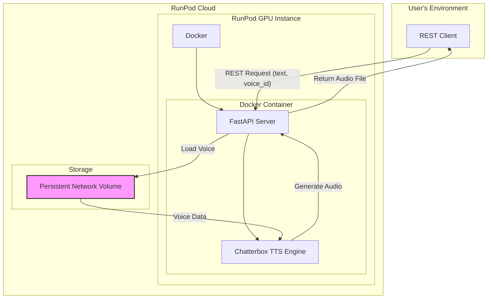

# Chatterbox TTS on RunPod: Architectural Plan

This document outlines the architecture for deploying a Chatterbox TTS (Text-to-Speech) service on RunPod, with support for custom cloned voices and real-time audio streaming.

## 1. System Overview

The system is designed to be a containerized application running on a RunPod GPU instance. It exposes a streaming API that allows clients to generate speech from text using specified cloned voices.

### High-Level Diagram



### Component Descriptions

*   **RunPod Instance:** A cloud-based virtual machine with a dedicated GPU (e.g., NVIDIA RTX 3090 or A-series GPUs) to accelerate the TTS model inference.
*   **Docker Container:** An isolated environment created from a Docker image that packages the application, its dependencies, and the necessary runtime. This ensures consistency across different environments.
*   **API Server:** A Python-based web server (using FastAPI) that handles REST requests. It manages voice models, generates speech, and can stream the audio back to the client.
*   **Chatterbox TTS Engine:** The core Python library responsible for synthesizing speech from text using the base TTS model and the selected cloned voice.
*   **Persistent Network Volume:** A network-attached storage volume provided by RunPod. It is used to store cloned voice files (e.g., `.pth` files) so they persist even if the RunPod instance is restarted or changed.

## 2. Technology Stack

*   **Base Docker Image:** `nvidia/cuda:12.1.1-cudnn8-devel-ubuntu22.04`. This provides the necessary NVIDIA drivers, CUDA toolkit, and cuDNN libraries for GPU acceleration.
*   **Python Version:** Python 3.10+
*   **Web Framework:** **FastAPI**. Chosen for its high performance, asynchronous capabilities (essential for streaming), and automatic data validation with Pydantic.
*   **ASGI Server:** **Uvicorn**. A lightning-fast ASGI server, required to run FastAPI.
*   **Core Libraries:**
    *   `torch` & `torchaudio`: For deep learning model operations and audio processing.
    *   `pydantic`: For data validation and settings management.

## 3. Containerization Strategy

The application is containerized using a multi-stage `Dockerfile` for a secure and optimized production image.

### Multi-Stage Dockerfile

*   **Builder Stage:** The first stage uses a `devel` image with the full CUDA toolkit to install dependencies and build the application. This keeps the final image smaller.
*   **Production Stage:** The second stage uses a lightweight `runtime` image and copies the application and virtual environment from the builder. It runs the application as a non-root user (`appuser`) for enhanced security.
*   **Health Check:** A `HEALTHCHECK` instruction is included to monitor the `/health` endpoint, allowing container orchestrators to manage the application's lifecycle automatically.

### Production Dockerfile

```dockerfile
# Stage 1: Builder Environment
FROM nvidia/cuda:12.5.1-cudnn8-devel-ubuntu22.04 AS builder

ENV PYTHONUNBUFFERED=1
WORKDIR /app

# Install Python and system dependencies
RUN apt-get update && apt-get install -y \
    python3.10 \
    python3.10-venv \
    libsndfile1 && \
    rm -rf /var/lib/apt/lists/*

# Create and activate a virtual environment
RUN python3.10 -m venv /app/venv
ENV PATH="/app/venv/bin:$PATH"

# Install Python dependencies
COPY requirements.txt .
RUN pip install --no-cache-dir --upgrade pip && \
    pip install --no-cache-dir -r requirements.txt

# Copy source code
COPY ./src ./src

# Stage 2: Production Environment
FROM nvidia/cuda:12.5.1-cudnn8-runtime-ubuntu22.04

# Create a non-root user for security
RUN useradd --create-home appuser
USER appuser
WORKDIR /home/appuser

# Copy the virtual environment and source code
COPY --from=builder /app/venv ./venv
COPY --from=builder /app/src ./src

# Set environment variables
ENV PYTHONUNBUFFERED=1
ENV PATH="/home/appuser/venv/bin:$PATH"

# Expose the application port
EXPOSE 8000

# Health check to ensure the application is running
HEALTHCHECK --interval=30s --timeout=10s --start-period=5s --retries=3 \
  CMD curl -f http://localhost:8000/health || exit 1

# Define the command to run the application
CMD ["uvicorn", "src.main:app", "--host", "0.0.0.0", "--port", "8000"]
```

## 4. API Design

The API will expose a RESTful endpoint for generating complete audio files.

### REST for File Generation

*   **Endpoint:** `POST /tts/generate`
*   **Description:** Generates and streams audio for the given text.

#### Request Body

A JSON object with the same structure as the WebSocket request:

```json
{
  "text": "Hello, this is a test of the text-to-speech system.",
  "voice_id": "cloned_voice_alpha"
}
```

#### Success Response

*   **Status Code:** `200 OK`
*   **Content-Type:** `audio/wav`
*   **Body:** The binary content of the generated `.wav` file.

#### Error Response

*   **Status Code:** `404 Not Found` (or other appropriate error code)
*   **Content-Type:** `application/json`
*   **Body:**
    ```json
    {
      "detail": "Voice 'cloned_voice_alpha' not found."
    }
    ```

### Example `curl` Command

```bash
curl -X POST \
  -H "Content-Type: application/json" \
  -H "X-API-Key: <YOUR_API_KEY>" \
  -d '{"text": "Hello, this is a test of the live demo."}' \
  http://localhost:8000/tts/generate --output demo_output.wav
```

### Endpoint 3: Voice Management APIs

A set of RESTful endpoints will be provided to manage custom voice models.

#### `POST /voices`

*   **Description:** Upload a new voice file.
*   **Request Body:** `multipart/form-data` with a single file field named `file`.
*   **Success Response:**
  *   **Status Code:** `201 Created`
  *   **Body:**
      ```json
      {
        "voice_id": "new_voice_name.pth",
        "message": "Voice uploaded successfully."
      }
      ```

#### `GET /voices`

*   **Description:** Get a list of all available voices.
*   **Success Response:**
  *   **Status Code:** `200 OK`
  *   **Body:**
      ```json
      [
        "cloned_voice_alpha.pth",
        "user_voice_beta.pth"
      ]
      ```

#### `DELETE /voices/{voice_id}`

*   **Description:** Delete a specific voice by its ID.
*   **Success Response:**
  *   **Status Code:** `200 OK`
  *   **Body:**
      ```json
      {
        "message": "Voice 'cloned_voice_alpha.pth' deleted successfully."
      }
      ```

## 5. Voice Management

A robust strategy for managing voice files is crucial for the system's flexibility and stability.

*   **Storage:** All cloned voice files (e.g., `cloned_voice_alpha.pth`, `user_voice_beta.pth`) will be stored in a directory within the container located at `/voices`. This directory will be mapped to a RunPod persistent network volume during deployment. This ensures that uploaded voices are not lost when the pod is stopped.
*   **Loading Strategy:** A lazy-loading mechanism will be implemented.
  1.  On startup, the application will scan the `/voices` directory and create a list of available `voice_id`s based on the filenames.
  2.  When a request for a specific `voice_id` is received, the server first checks if the corresponding voice model is already loaded in memory (in a cache).
  3.  If not, it loads the voice file from the `/voices` directory into GPU memory and adds it to the cache.
  4.  This approach conserves memory by only loading the voices that are actively being used.
*   **Access:** The `voice_id` provided in the API request directly maps to the filename of the voice model (e.g., `voice_id: "cloned_voice_alpha"` maps to the file `/voices/cloned_voice_alpha.pth`).

## 6. Voice Cloning Workflow

This section describes the process for creating a new cloned voice from audio samples. The voice cloning process is assumed to be an offline task performed by a developer or administrator. The resulting voice file is then uploaded to the persistent volume for use by the API.

### Prerequisites

*   **High-Quality Audio Samples:** At least 1-5 minutes of clean, single-speaker audio data. The audio should be free of background noise, music, and other voices.
    *   Format: `.wav` files
    *   Sample Rate: 22,050 Hz or 44,100 Hz
    *   Bit Depth: 16-bit
*   **Voice Cloning Scripts:** The Chatterbox TTS project should include scripts for processing audio and training the voice cloning model. These scripts are not part of the API server but are essential for generating voice files.

### Step-by-Step Guide

1.  **Prepare the Dataset:**
    *   Collect all audio samples for the target voice into a single directory.
    *   If necessary, split long audio files into smaller segments (e.g., 5-15 seconds each).

2.  **Run the Cloning Script:**
    *   The project will provide a command-line script (e.g., `python clone_voice.py`) to perform the cloning.
    *   Execute the script, providing the path to the audio samples directory and an output name for the new voice.
    ```bash
    python scripts/clone_voice.py \
      --input_dir /path/to/audio/samples \
      --output_voice_id new_voice_name
    ```

3.  **Training:**
    *   The script will process the audio, extract voice features, and fine-tune a base TTS model to create the voice clone.
    *   This process is computationally intensive and should be run on a machine with a powerful GPU.

4.  **Retrieve the Output File:**
    *   Upon successful completion, the script will generate a voice file (e.g., `new_voice_name.pth`).
    *   This file contains the trained voice model.

5.  **Deploy the New Voice:**
    *   Upload the generated `.pth` file to the `/voices` directory in the RunPod persistent volume.
    *   The API server will automatically detect the new file and make it available for use with the corresponding `voice_id` (e.g., `"new_voice_name"`).

## 6. Deployment Workflow

This section provides a step-by-step guide for deploying the Chatterbox TTS service to RunPod.

1.  **Prepare Project:**
    *   Clone the application repository to your local machine.
    *   Ensure you have Docker installed.

2.  **Build Docker Image:**
    *   Navigate to the project's root directory (where the `Dockerfile` is).
    *   Build the Docker image:
        ```bash
        docker build -t your-dockerhub-username/chatterbox-tts:latest .
        ```

3.  **Push Image to Registry:**
    *   Log in to your Docker Hub account (or another container registry).
    *   Push the image:
        ```bash
        docker push your-dockerhub-username/chatterbox-tts:latest
        ```

4.  **Configure and Deploy RunPod Pod:**
    *   Log in to your RunPod account.
    *   Create a new **GPU Pod**.
    *   Select a suitable GPU (e.g., RTX 3090).
    *   In the "Docker Image Name" field, enter the name of the image you just pushed: `your-dockerhub-username/chatterbox-tts:latest`.
    *   **Configure Persistent Volume:** Create or attach a network volume. Set the container's volume path to `/voices`. This is where you will upload your voice files.
    *   **Expose Ports:** Expose the container's port `8000` via TCP. RunPod will map this to a public URL.
    *   Launch the pod.

5.  **Upload Cloned Voices:**
    *   Once the pod is running, use the RunPod web interface or a tool like `scp` to upload your `.pth` voice files into the persistent volume you created.

6.  **Test the Service:**
    *   Find the public URL for your service in the RunPod "My Pods" dashboard.
    *   Use a tool like `curl` to send a request to the `/tts/generate` endpoint and verify that you receive an audio file in response.