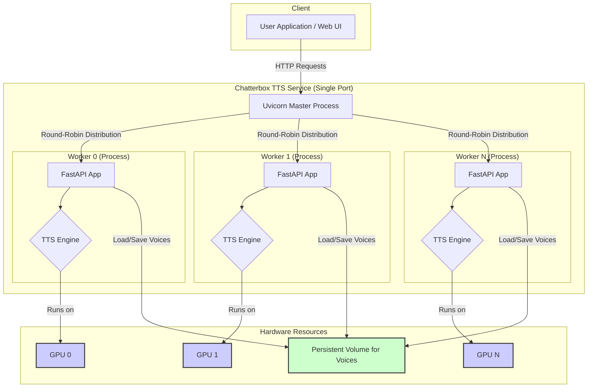
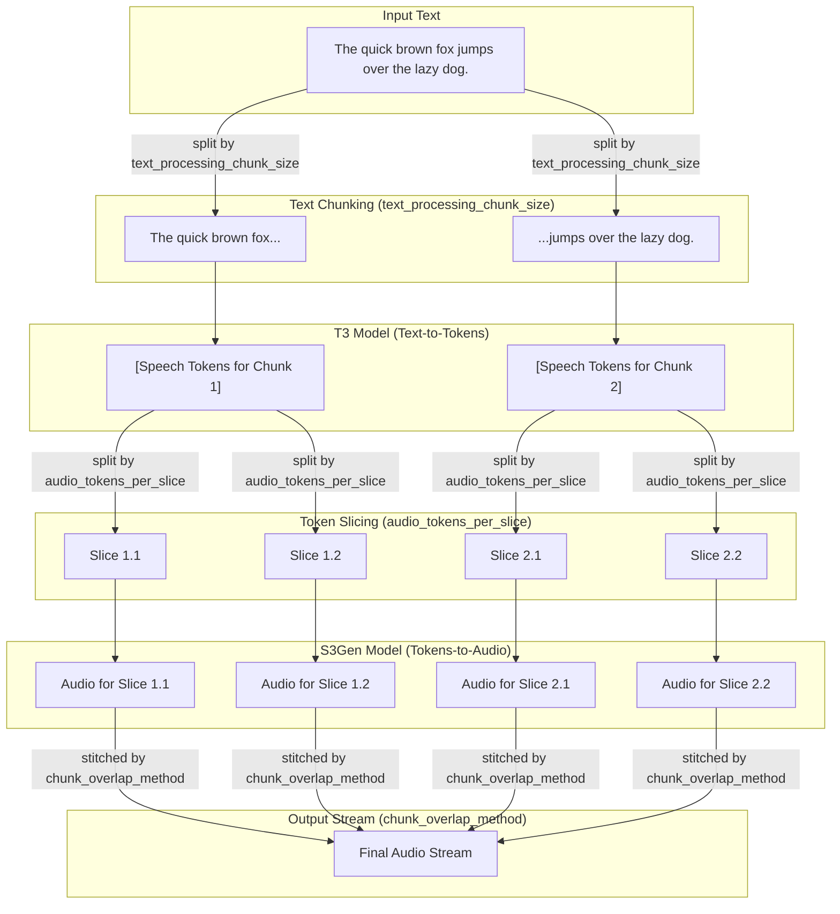
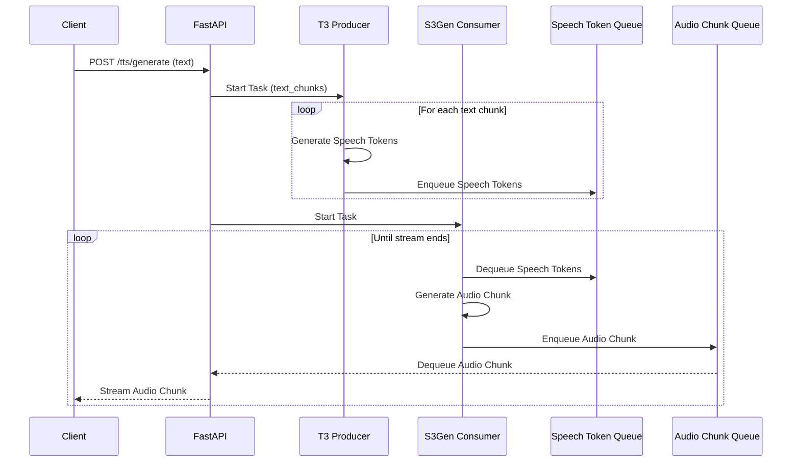

# Chatterbox TTS

Chatterbox TTS is a high-performance, containerized Text-to-Speech (TTS) service designed for real-time audio generation and streaming. It supports custom voice cloning and is optimized for deployment on GPU-accelerated platforms like RunPod.

## Project Overview

This project provides a flexible and scalable solution for generating speech from text. It exposes a robust RESTful API for real-time streaming and is built for stable, concurrent request handling in a production environment.

### High-Level Architecture

The service uses a multi-worker architecture where each available GPU is assigned its own dedicated worker process. This is managed by a single `uvicorn` instance that listens on one port and distributes incoming requests to the pool of workers. This model provides true parallelism, maximizing GPU utilization and overall throughput.

A semaphore is used to control the number of concurrent TTS tasks that can run on a single GPU, preventing overload while leaving other API endpoints responsive. Each concurrent task is processed in its own dedicated CUDA stream for optimal performance.



## Prerequisites

To run this project, you will need:

*   **Docker**: The application is containerized and requires Docker to be installed.
*   **GPU**: A CUDA-enabled GPU is necessary for the TTS model to perform efficiently.

## Configuration

Configuration is managed via environment variables. You can set them in your shell or create a `.env` file in the project root.

### Core Application Settings

| Variable                      | Description                                                                                             | Default              |
| ----------------------------- | ------------------------------------------------------------------------------------------------------- | -------------------- |
| `API_KEY`                     | **(Required)** Your secret API key for securing the service.                                            | `None`               |
| `HOST`                        | The host address for the application server.                                                            | `0.0.0.0`            |
| `PORT`                        | The port for the application server.                                                                    | `8000`               |
| `DEBUG`                       | Enable debug mode. **Forces worker count to 1.**                                                        | `False`              |
| `LOG_LEVEL`                   | The logging level (e.g., `INFO`, `DEBUG`).                                                              | `INFO`               |
| `CONCURRENT_REQUESTS_PER_WORKER` | Maximum number of concurrent TTS requests to process per GPU.                                           | `1`                  |
| `VOICES_DIR`                  | Directory where custom voices are stored.                                                               | `/app/voices/`            |
| `PRELOADED_VOICES_DIR`        | Directory for preloaded voices.                                                                         | `/app/preloaded-voices/`  |
| `MODEL_PATH`                  | Path to the directory containing TTS models.                                                            | `models`             |
| `CORS_ORIGINS`                | A comma-separated list of allowed origins (e.g., `"http://localhost:3000,https://your-frontend.com"`).    | `*`                  |

### TTS Engine Tuning

These parameters control the TTS engine's behavior and can be set via environment variables prefixed with `TTS_`.

| Variable                            | Description                                                                                             | Default      |
| ----------------------------------- | ------------------------------------------------------------------------------------------------------- | ------------ |
| `TTS_VOICE_EXAGGERATION_FACTOR`     | Controls the expressiveness of the voice.                                                               | `0.5`        |
| `TTS_CFG_GUIDANCE_WEIGHT`           | Influences how strongly the model adheres to the text prompt.                                           | `0.5`        |
| `TTS_SYNTHESIS_TEMPERATURE`         | Controls the randomness of the output.                                                                  | `0.8`        |
| `TTS_TEXT_PROCESSING_CHUNK_SIZE`    | Max characters per text chunk. Smaller values can reduce latency.                                       | `150`        |
| `TTS_AUDIO_TOKENS_PER_SLICE`        | Number of audio tokens per slice during streaming. Affects granularity.                                 | `35`         |
| `TTS_REMOVE_LEADING_MILLISECONDS`   | Milliseconds to trim from the start of the audio.                                                       | `0`          |
| `TTS_REMOVE_TRAILING_MILLISECONDS`  | Milliseconds to trim from the end of the audio.                                                         | `0`          |
| `TTS_CHUNK_OVERLAP_STRATEGY`        | Strategy for overlapping audio chunks: `"full"` or `"zero"`.                                            | `"full"`     |
| `TTS_CROSSFADE_DURATION_MILLISECONDS` | Duration in milliseconds for crossfading between audio chunks.                                          | `30`         |
| `TTS_SPEECH_TOKEN_QUEUE_MAX_SIZE`   | Buffer size between T3 and S3Gen models. Smaller values (`~2`) reduce initial latency.                  | `2`          |
| `TTS_PCM_CHUNK_QUEUE_MAX_SIZE`      | Buffer size for outgoing audio. Smaller values (`~3`) reduce latency but increase stutter risk.         | `3`          |

### Example `.env` file:

```
# Server Settings
API_KEY="your-super-secret-api-key"
CONCURRENT_REQUESTS_PER_WORKER=2 # Allow 2 TTS tasks per GPU

# TTS Tuning for Low Latency
TTS_SPEECH_TOKEN_QUEUE_MAX_SIZE=2
TTS_PCM_CHUNK_QUEUE_MAX_SIZE=3
```

## Setup and Deployment

### 1. Build the Docker Image

From the project's root directory, build the Docker image:

```bash
docker build -t chatterbox-tts:latest .
```

### 2. Run the Docker Container

Run the container, mapping port `8000`, providing the environment variables, and mounting a volume for persistent voice storage:

```bash
docker run -d -p 8000:8000 \
  --gpus all \
  -v $(pwd)/voices:/app/voices \
  --env-file .env \
  --name chatterbox-tts \
  chatterbox-tts:latest
```

## Docker Hub and GitHub Actions

### Using the Pre-built Docker Image

Instead of building the Docker image locally, you can use the pre-built image from Docker Hub, which is automatically updated with the latest changes.

**1. Pull the Image**

```bash
docker pull akashdeep000/chatterbox-tts:latest
```

**2. Run the Container**

Use the pulled image to run the container:

```bash
docker run -d -p 8000:8000 \
  --gpus all \
  -v $(pwd)/voices:/app/voices \
  --env-file .env \
  --name chatterbox-tts \
  akashdeep000/chatterbox-tts:latest
```

### Automated Builds with GitHub Actions

This repository uses GitHub Actions to automate the building and publishing of the Docker image to Docker Hub. On every push, a new image is built and tagged with `latest` and the commit SHA.

You can view the workflow configuration at [`.github/workflows/publish-docker.yml`](.github/workflows/publish-docker.yml:1).

#### Setup

To enable the workflow to publish to your Docker Hub account, you need to configure the following repository secrets and variables in your GitHub repository settings:

1.  **`DOCKERHUB_USERNAME`**:
    *   **Type**: Variable
    *   **Value**: Your Docker Hub username.
    *   Go to `Settings` > `Secrets and variables` > `Actions` > `Variables` and add a new repository variable.

2.  **`DOCKERHUB_TOKEN`**:
    *   **Type**: Secret
    *   **Value**: Your Docker Hub access token. You can generate one in your Docker Hub account settings.
    *   Go to `Settings` > `Secrets and variables` > `Actions` > `Secrets` and add a new repository secret.


## API Usage

### System Status: `GET /system-status`
Provides real-time CPU, RAM, and GPU utilization details. Useful for monitoring the health and load of the service.

**Example with `curl`:**
```bash
curl -X GET -H "X-API-Key: <YOUR_API_KEY>" http://localhost:8000/system-status
```

**Example Response:**
```json
{
  "cpu": {
    "utilization_percent": 25.8,
    "ram_gb": { "total": 31.26, "used": 8.94, "free": 22.32, "percent_used": 28.6 }
  },
  "gpu": {
    "device_id": 0,
    "utilization_percent": { "gpu": 45, "memory": 28 },
    "memory_gb": { "total": 15.75, "used": 3.15, "free": 12.6 }
  }
}
```

### TTS Generation: `/tts/generate`

This endpoint generates and streams audio in real-time. It supports both `GET` and `POST` requests, providing flexibility for different use cases.

#### Authentication

For all requests to this endpoint, the API key can be provided in one of two ways:
*   **Header:** `X-API-Key: <YOUR_API_KEY>`
*   **Query Parameter:** `?api_key=<YOUR_API_KEY>`

#### POST Request

This method is suitable for server-to-server communication or when the text is long.

**Example with `curl`:**
```bash
curl -X POST \
  -H "Content-Type: application/json" \
  -H "X-API-Key: <YOUR_API_KEY>" \
  -d '{"text": "Hello, this is a custom voice.", "voice_id": "your_voice.wav"}' \
  http://localhost:8000/tts/generate --output custom_voice_output.wav
```

#### GET Request

This method is ideal for use in web browsers, as it allows you to set the endpoint URL directly as the `src` of an `<audio>` tag.

**Example with `curl`:**
```bash
curl -X GET "http://localhost:8000/tts/generate?text=Hello%20world&voice_id=your_voice.wav&api_key=<YOUR_API_KEY>&format=mp3" --output output.mp3
```

**Example in HTML:**
```html
<audio controls src="http://localhost:8000/tts/generate?text=Hello%20world&api_key=<YOUR_API_KEY>&format=mp3"></audio>
```

#### Advanced Usage: Streaming with Media Source Extensions (MSE)

For the lowest latency playback in web applications, you can use the [Media Source Extensions (MSE) API](https://developer.mozilla.org/en-US/docs/Web/API/Media_Source_Extensions_API) to handle the incoming audio stream. This approach gives you fine-grained control over buffering and playback.

The `fmp4` (Fragmented MP4) format is recommended for use with MSE.

**Example with MSE:**

```html
<!DOCTYPE html>
<html lang="en">
<head>
    <meta charset="UTF-8">
    <title>MSE Streaming Example</title>
</head>
<body>
    <h1>Real-time TTS Streaming with MSE</h1>
    <audio id="audioPlayer" controls></audio>
    <br>
    <input type="text" id="textInput" value="Hello from the world of real-time audio streaming.">
    <button id="playButton">Play</button>

    <script>
        const audioPlayer = document.getElementById('audioPlayer');
        const textInput = document.getElementById('textInput');
        const playButton = document.getElementById('playButton');
        const apiKey = 'YOUR_API_KEY'; // Replace with your actual API key

        playButton.addEventListener('click', async () => {
            const text = encodeURIComponent(textInput.value);
            const url = `http://localhost:8000/tts/generate?text=${text}&api_key=${apiKey}&format=fmp4`;

            if (window.MediaSource && MediaSource.isTypeSupported('audio/mp4; codecs="mp4a.40.2"')) {
                const mediaSource = new MediaSource();
                audioPlayer.src = URL.createObjectURL(mediaSource);

                mediaSource.addEventListener('sourceopen', () => {
                    const sourceBuffer = mediaSource.addSourceBuffer('audio/mp4; codecs="mp4a.40.2"');

                    fetch(url)
                        .then(response => {
                            if (!response.ok) {
                                throw new Error(`HTTP error! status: ${response.status}`);
                            }
                            const reader = response.body.getReader();

                            function push() {
                                reader.read().then(({ done, value }) => {
                                    if (done) {
                                        if (!mediaSource.ended) {
                                           mediaSource.endOfStream();
                                        }
                                        return;
                                    }
                                    sourceBuffer.appendBuffer(value);
                                    push();
                                }).catch(err => {
                                    console.error('Error reading stream:', err);
                                });
                            }

                            sourceBuffer.addEventListener('updateend', push, { once: true });
                            push();
                        })
                        .catch(e => console.error('Fetch error:', e));
                });

                audioPlayer.play();
            } else {
                console.error("MSE or the required codec is not supported.");
                // Fallback for browsers that don't support MSE
                audioPlayer.src = url;
                audioPlayer.play();
            }
        });
    </script>
</body>
</html>
```

#### TTS Parameters

The `/tts/generate` endpoint accepts several parameters to customize the audio generation. These can be provided in the query string for `GET` requests or in the JSON body for `POST` requests.

| Parameter                   | Type    | Default Value      | Description                                                                                                                            |
| --------------------------- | ------- | ------------------ | -------------------------------------------------------------------------------------------------------------------------------------- |
| `text`                      | string  | **(Required)**     | The text to be converted to speech.                                                                                                    |
| `voice_id`                  | string  | `None`             | The ID of the custom voice to use (e.g., `your_voice.wav`). If not provided, a default voice is used.                                    |
| `format`                    | string  | `wav`              | The desired audio format. Supported values: `wav`, `mp3`, `fmp4`, `raw_pcm`, `webm`. Overrides the `Accept` header.                        |
| `cfg_guidance_weight`                | float   | `TTS_CFG_GUIDANCE_WEIGHT`       | Classifier-Free Guidance weight. Higher values make the speech more closely follow the text, but can reduce naturalness.               |
| `synthesis_temperature`               | float   | `TTS_SYNTHESIS_TEMPERATURE`     | Controls the randomness of the output. Higher values produce more varied and creative speech, while lower values are more deterministic. |
| `text_processing_chunk_size`           | integer | `TTS_TEXT_PROCESSING_CHUNK_SIZE`| The number of characters to process in each text chunk. Smaller values can reduce latency but may affect prosody.                      |
| `audio_tokens_per_slice`          | integer | `TTS_AUDIO_TOKENS_PER_SLICE`    | The number of audio tokens to generate in each slice. This affects the granularity of the streaming output.                            |
| `remove_trailing_milliseconds`       | integer | `TTS_REMOVE_TRAILING_MILLISECONDS`| The number of milliseconds to trim from the end of the final audio chunk.                        |
| `remove_leading_milliseconds` | integer | `TTS_REMOVE_LEADING_MILLISECONDS`| The number of milliseconds to trim from the beginning of the first audio chunk.                                                        |
| `chunk_overlap_method`      | string  | `TTS_CHUNK_OVERLAP_STRATEGY`    | The method for handling overlapping audio chunks. Can be `"full"` or `"zero"`.                                                         |
| `crossfade_duration_milliseconds`        | integer   | `TTS_CROSSFADE_DURATION_MILLISECONDS`| The duration of the crossfade between audio chunks in milliseconds.

## Performance & Architecture Deep Dive

The service is engineered for high throughput and low latency via several key design choices:

*   **Multi-Process Parallelism**: By running one process per GPU, we sidestep Python's Global Interpreter Lock (GIL) and achieve true parallel execution of the computationally expensive TTS models.
*   **Route-Specific Concurrency Control**: A configurable `asyncio.Semaphore` protects the `/tts/generate` route, preventing any single GPU from being overloaded while ensuring other API endpoints remain responsive.
*   **Per-Request CUDA Streams**: When concurrency is set above 1, each TTS task is executed in its own dedicated CUDA stream. This allows the GPU's scheduler to intelligently overlap operations from different tasks, maximizing hardware utilization.
*   **Aggressive Pre-caching**: All available voices are pre-processed and cached in GPU memory at startup, eliminating warm-up latency for the first request of any voice.
*   **Asynchronous Streaming Pipeline**: A producer-consumer pattern between the two stages of the TTS model (T3 and S3Gen) ensures a smooth, continuous flow of audio data without stalls.

### Performance Optimizations

The TTS engine is optimized for real-time performance through several mechanisms:

#### Parameter Tuning for Quality and Speed

The `text_processing_chunk_size`, `audio_tokens_per_slice`, and `chunk_overlap_method` parameters are crucial for balancing audio quality and streaming latency. Understanding how they work together allows you to fine-tune the TTS engine for your specific needs.

*   **`text_processing_chunk_size`**: This parameter determines how the input text is split into smaller pieces. The T3 model processes one chunk at a time.
    *   **Smaller values** (e.g., 50) lead to lower "time to first audio" because the first chunk is processed faster. However, this can sometimes result in less natural prosody, as the model has less context.
    *   **Larger values** (e.g., 200) provide more context to the model, which can improve the naturalness of the speech, but it will take longer to receive the first audio chunk.

*   **`audio_tokens_per_slice`**: After the T3 model converts a text chunk into a sequence of speech tokens, this parameter determines how many of those tokens are sent to the S3Gen model at a time to be converted into audio.
    *   **Smaller values** (e.g., 20) result in smaller, more frequent audio chunks being streamed to the client, which can create a smoother streaming experience.
    *   **Larger values** (e.g., 50) will result in fewer, larger audio chunks, which can be more efficient but may feel less "real-time."

*   **`chunk_overlap_method`**: This parameter defines how the audio from different text chunks is stitched together.
    *   **`"full"`**: This method creates a seamless overlap between audio chunks, which generally produces the highest quality audio by avoiding clicks or pauses. It is slightly more computationally intensive.
    *   **`"zero"`**: This method simply concatenates the audio chunks. It is faster but may occasionally produce audible artifacts at the seams between chunks.

*   **`crossfade_duration_milliseconds`**: This parameter determines the duration of the crossfade between audio chunks.

The following diagram illustrates how these parameters relate to each other in the TTS process:



*   **Aggressive Pre-caching**: To eliminate warm-up latency, the service pre-loads all TTS models and pre-caches the conditioning data for *all available voices* into GPU memory at startup. This ensures that every voice is ready for immediate, high-performance inference from the very first request.
*   **Intelligent Cache Invalidation**: The voice cache is automatically and precisely invalidated when a voice is updated or deleted, guaranteeing that the system always uses the most recent voice data without requiring a manual restart.
*   **Asynchronous Streaming Pipeline**: The core of the real-time streaming is a highly efficient producer-consumer pattern. The T3 model (producer) generates speech tokens concurrently while the S3Gen model (consumer) converts them into audio. This decoupling prevents stalls and ensures a smooth, continuous flow of audio data.
*   **Proactive Inference**: The pipeline uses a signaling mechanism that allows the T3 model to proactively start processing the *next* chunk of text while the S3Gen model is still working on the current one. This advanced optimization minimizes gaps in audio generation, leading to a significant reduction in perceived latency for longer texts.

#### Real-Time TTS Generation Sequence

The real-time audio streaming is achieved through a producer-consumer pattern, where the T3 model produces speech tokens and the S3Gen model consumes them to generate audio. This allows for a continuous stream of audio with low latency.



### Voice Management API

The service provides a set of RESTful endpoints to manage custom voices.

#### Voice Caching and Management

The voice management system is designed for efficiency and scalability. When a voice is uploaded, it is stored persistently. To ensure the lowest possible latency, the application automatically pre-caches all available voices into memory on startup. This means that all voices are ready for immediate use without any warm-up delay on the first request. The cache is also intelligently invalidated and updated whenever a voice is uploaded or deleted.

#### Upload a Voice

*   **Endpoint:** `POST /voices`
*   **Description:** Upload a new voice file. The `voice_id` will be the filename.
*   **Request:** `multipart/form-data` with a file named `voice.wav`.
*   **Headers:** `X-API-Key: <YOUR_API_KEY>`

**Example with `curl`:**

```bash
curl -X POST \
  -H "X-API-Key: <YOUR_API_KEY>" \
  -F "file=@/path/to/your/voice.wav" \
  http://localhost:8000/voices
```

**Success Response (`201 Created`):**

```json
{
  "voice_id": "voice.wav",
  "message": "Voice uploaded successfully."
}
```

#### List Voices

*   **Endpoint:** `GET /voices`
*   **Description:** Get a list of all available voice IDs.
*   **Headers:** `X-API-Key: <YOUR_API_KEY>`

**Example with `curl`:**

```bash
curl -X GET \
  -H "X-API-Key: <YOUR_API_KEY>" \
  http://localhost:8000/voices
```

**Success Response (`200 OK`):**

```json
[
  "voice1.wav",
  "voice2.mp3"
]
```

#### Delete a Voice

*   **Endpoint:** `DELETE /voices/{voice_id}`
*   **Description:** Delete a specific voice by its ID.
*   **Headers:** `X-API-Key: <YOUR_API_KEY>`

**Example with `curl`:**

```bash
curl -X DELETE \
  -H "X-API-Key: <YOUR_API_KEY>" \
  http://localhost:8000/voices/voice.wav
```

**Success Response (`200 OK`):**

```json
{
  "message": "Voice 'voice.wav' deleted successfully."
}
```

## RunPod Deployment Notes

This project is optimized for deployment on cloud platforms like [RunPod](https://runpod.io), where you can easily deploy the container as a serverless GPU endpoint. When deploying on RunPod, ensure you:

1.  Use the Docker image you built (`your-docker-username/chatterbox-tts:latest`) or the pre-built image from Docker Hub (`akashdeep000/chatterbox-tts:latest`).
2.  Configure a persistent volume and map it to `/app/voices` in the container.
3.  Expose the container's port `8000`.

This setup allows you to manage a scalable, high-performance TTS service with ease.